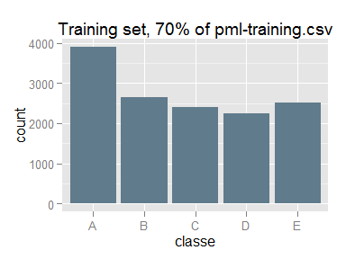
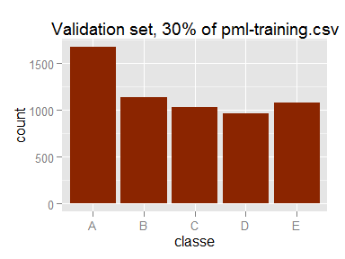

# ml-wl-project
david harper  
September 26, 2015  

# Practical Machine Learning/Course Project: Weight Lifting (WL) Prediction  
## Introduction
This was my first exposure to machine learning. It has been very challenging, but I do feel introduced to machine learning! This project's dataset is based on research described in _Qualitative Activity Recognition of Weight Lifting Exercises_ by Velloso et al (see endnote 1). The domain is human activity recognition. I am keenly interested because I just started wearing a new FitBit HR Charge which contains a 3-axis accelerometer, altimeter and optical heart rate monitor. 

This project's sensors are more sophisticated: in addition to a three-axis accelerometer, they contain a triple-axis gyroscope and magnetometer. Six male, young (age 20 to 28), inexperienced (in weightlifting) participants were supervised by an experienced weight lifter. According to the authors, "Participants were asked to perform one set of 10 repetitions of the Unilateral Dumbbell Biceps Curl in five different fashions: exactly according to the specification (Class A), throwing the elbows to the front (Class B), lifting the dumbbell only halfway (Class C), lowering the dumbbell only halfway (Class D) and throwing the hips to the front (Class E). Class A corresponds to the specified execution of the exercise, while the other 4 classes correspond to common mistakes." As the dataset shows, each participant wore four sensors. One sensor each on the belt, on the arm, on the dumbbell, and on the glove (aka, forearm).

My goal is to predict the class of exercise (A to E) based on the sensor data. I am happy to see my algorithm score a perfect 20/20. Here is my approach.

Get libraries ...

```r
# libraries
library(AppliedPredictiveModeling)
library(ggplot2)
library(caret, quietly = TRUE)
library(rpart); library(rpart.plot)
library(rattle, quietly = TRUE)
library(randomForest, quietly = TRUE)
library(dplyr, quietly = TRUE)
```

Retrieve training and testing files. I inspected them first in Excel. Both have 160 columns. In training.csv, the exercise class (i.e., A, B, C, D or E) are found under "classe", while testing excludes that information, of course.

```r
url.train <- 'https://d396qusza40orc.cloudfront.net/predmachlearn/pml-training.csv'
url.test <- 'https://d396qusza40orc.cloudfront.net/predmachlearn/pml-testing.csv'

# download.file(url = url.train, destfile = 'wl-train.csv')
# download.file(url = url.test, destfile = 'wl-test.csv')

wl.train.raw <- read.csv(file = "wl-train.csv", na.strings = c("NA", "#DIV/0!", ""))
wl.test.raw <- read.csv(file = "wl-test.csv", na.strings = c("NA", "#DIV/0!", ""))
```

## Pre-processing
I conducted three pre-processing steps. First, I eliminated most of the columns because they contained NAs. I considered a cuttoff (e.g., 80% NA in the column), but Excel easily reveals the dataset contains only two patterns: columns with only data, or columns with about 98% NAs. So I simply excluded all columns with any NAs, which reduced the useful dataframe to 53 variables (after chopping off the first seven columns of meta-data). Second, I went to exclude variables with near-zero variance, but none of the remaining 53 variables were trapped by this. Third, I standardized the variables per Jeff Leek's lecture on Preprocessing (although I did not analyze the effect of this, I was just trying to improve the quality of the predictors).

```r
# wl.train.pre1.col retains only columns without NAs; i.e., colSums must be zero to include column
# wl.train.pre2 excludes first seven columns
# wl.train.pre3 excludes near zero-variance columns but this has no effect (53 variables remain)
wl.train.pre1.col <- colnames(wl.train.raw[colSums(is.na(wl.train.raw)) == 0])
wl.train.pre2.col <- wl.train.pre1.col[-c(1:7)] # first seven columns of meta-data are not useful; eg, timestamp
wl.train.pre2 <- wl.train.raw[ ,wl.train.pre2.col]
wl.train.pre3 <- wl.train.pre2[, nearZeroVar(wl.train.pre2, saveMetrics=TRUE)$nzv==FALSE]

# wl.train.pre4 standardized the variables
preObj.standard <- preProcess(wl.train.pre3[, -53], method=c("center","scale"))
wl.train.pre4 <- predict(preObj.standard, wl.train.pre3[, -53])
# round(summarize_each(wl.train.pre4, funs(mean)), 3); round(summarize_each(wl.train.pre4, funs(sd)), 3)
wl.train.pre4$classe <- wl.train.pre3$classe
```

Now I pre-process the test set in similar fashion. As noted in the lecture, it's important to standardize the test set variables with the TRAINING set's normal parameters. A good check is confirm that the training set has standard normal parameters (zero mean and unit variance) but you would not expect the testing set to exhibit the same. 

```r
# repeat pre-processing on test set
wl.test.pre1.col <- colnames(wl.test.raw[colSums(is.na(wl.test.raw)) == 0])
wl.test.pre2.col <- wl.test.pre1.col[-c(1:7)]
# Verify column names are the same
all.equal(wl.train.pre2.col[1:length(wl.train.pre2.col)-1], wl.test.pre2.col[1:length(wl.test.pre2.col)-1])
```

```
## [1] TRUE
```

```r
wl.test.pre2 <- wl.test.raw[ , wl.test.pre2.col]
wl.test.pre3 <- wl.test.pre2 # Note the column 53 contains Problem ID placeholders: 1, 2, ...

# Standardize the test set but using the training set parameters
wl.test.pre4 <- predict(preObj.standard, wl.test.pre3[, -53])
# Unlike training set, We do not expect these to have mean of zero and standard deviation of 1.0
# round(summarize_each(wl.test.pre4, funs(mean)), 3); round(summarize_each(wl.test.pre4, funs(sd)), 3)
wl.test.pre4$classe <- wl.test.pre3$problem_id
```

## Create cross-validation set
I split the (raw) training set into a training set (70%) and a validation set (30%). That is, the actual training set is 70% of the observations in the original pml-traing.csv. 

```r
# Split training into training & validation; I am using 70% and 30%
set.seed(789)
in.train <- createDataPartition(y = wl.train.pre4$classe, p = 0.70, list=FALSE)
wl.train <- wl.train.pre4[in.train,]
wl.validate <- wl.train.pre4[-in.train, ]
```

## Quick look at distribution of Classes in Training and Validation Sets

```r
ggp <- ggplot(wl.train, aes(x=classe))
ggp + geom_histogram(fill="lightskyblue4") + labs(title="Training set, 70% of pml-training.csv")
```

 

```r
ggp2 <- ggplot(wl.validate, aes(x=classe))
ggp2 + geom_histogram(fill="orangered4") + labs(title="Validation set, 30% of pml-training.csv")
```

 

## Random Forest
Although I played with some simpler models, my first random forest looked great, out of the box. Spooked by forum discussion processing times (hours?!), I limited the model but it's still very accurate. Overall accuracy on the validation set is 99.3%, with high sensitivity and specificity across each of the five classes. As the confusion matrix on the validation set shows, the estimated error rate is about 0.70% = 100% - 99.3%; i.e., 41 misclassifications out of 5,885 observations.  

```r
# Train random forest model, keeping it relatively quick with low number
wl.modFit.rf <- train(classe ~ ., data=wl.train, method = "rf", trControl = trainControl(method = "cv", number = 5, allowParallel = TRUE))

# Cross validate on itself (training model) so should be accurate
wl.pred.train <-  predict(wl.modFit.rf, wl.train)
confusionMatrix(wl.pred.train, wl.train$classe)
```

```
## Confusion Matrix and Statistics
## 
##           Reference
## Prediction    A    B    C    D    E
##          A 3906    0    0    0    0
##          B    0 2658    0    0    0
##          C    0    0 2396    0    0
##          D    0    0    0 2252    0
##          E    0    0    0    0 2525
## 
## Overall Statistics
##                                      
##                Accuracy : 1          
##                  95% CI : (0.9997, 1)
##     No Information Rate : 0.2843     
##     P-Value [Acc > NIR] : < 2.2e-16  
##                                      
##                   Kappa : 1          
##  Mcnemar's Test P-Value : NA         
## 
## Statistics by Class:
## 
##                      Class: A Class: B Class: C Class: D Class: E
## Sensitivity            1.0000   1.0000   1.0000   1.0000   1.0000
## Specificity            1.0000   1.0000   1.0000   1.0000   1.0000
## Pos Pred Value         1.0000   1.0000   1.0000   1.0000   1.0000
## Neg Pred Value         1.0000   1.0000   1.0000   1.0000   1.0000
## Prevalence             0.2843   0.1935   0.1744   0.1639   0.1838
## Detection Rate         0.2843   0.1935   0.1744   0.1639   0.1838
## Detection Prevalence   0.2843   0.1935   0.1744   0.1639   0.1838
## Balanced Accuracy      1.0000   1.0000   1.0000   1.0000   1.0000
```

```r
# Cross validate on validation set
wl.pred.validate <- predict(wl.modFit.rf, wl.validate)
confusionMatrix(wl.pred.validate, wl.validate$classe)
```

```
## Confusion Matrix and Statistics
## 
##           Reference
## Prediction    A    B    C    D    E
##          A 1672    8    0    0    0
##          B    0 1129    3    0    0
##          C    1    2 1016   14    3
##          D    0    0    7  950    2
##          E    1    0    0    0 1077
## 
## Overall Statistics
##                                          
##                Accuracy : 0.993          
##                  95% CI : (0.9906, 0.995)
##     No Information Rate : 0.2845         
##     P-Value [Acc > NIR] : < 2.2e-16      
##                                          
##                   Kappa : 0.9912         
##  Mcnemar's Test P-Value : NA             
## 
## Statistics by Class:
## 
##                      Class: A Class: B Class: C Class: D Class: E
## Sensitivity            0.9988   0.9912   0.9903   0.9855   0.9954
## Specificity            0.9981   0.9994   0.9959   0.9982   0.9998
## Pos Pred Value         0.9952   0.9973   0.9807   0.9906   0.9991
## Neg Pred Value         0.9995   0.9979   0.9979   0.9972   0.9990
## Prevalence             0.2845   0.1935   0.1743   0.1638   0.1839
## Detection Rate         0.2841   0.1918   0.1726   0.1614   0.1830
## Detection Prevalence   0.2855   0.1924   0.1760   0.1630   0.1832
## Balanced Accuracy      0.9985   0.9953   0.9931   0.9918   0.9976
```

This algorithm gave me enough confidence to submit ... 

```r
# Predict on test set
wl.pred.test <- predict(wl.modFit.rf, wl.test.pre4)
wl.pred.test
```

```
##  [1] B A B A A E D B A A B C B A E E A B B B
## Levels: A B C D E
```

```r
# Submit
wl.pred.test <- as.character(wl.pred.test)

# Function retreived from Instructions
pml_write_files = function(x) { 
  n = length(x)
  for(i in 1:n) { 
    filename <- paste0("problem_id_", i, ".txt")
    write.table(x[i],file=filename,quote=FALSE,row.names=FALSE,col.names=FALSE)
  }
}

pml_write_files(wl.pred.test)
```

Thank you for reading my submission.

## Endnote
Endnotes: 
1. Velloso, E.; Bulling, A.; Gellersen, H.; Ugulino, W.; Fuks, H. Qualitative Activity Recognition of Weight Lifting Exercises. Proceedings of 4th International Conference in Cooperation with SIGCHI (Augmented Human '13) . Stuttgart, Germany: ACM SIGCHI, 2013. Read more: http://groupware.les.inf.puc-rio.br/har#dataset#ixzz3muMT7WNa
